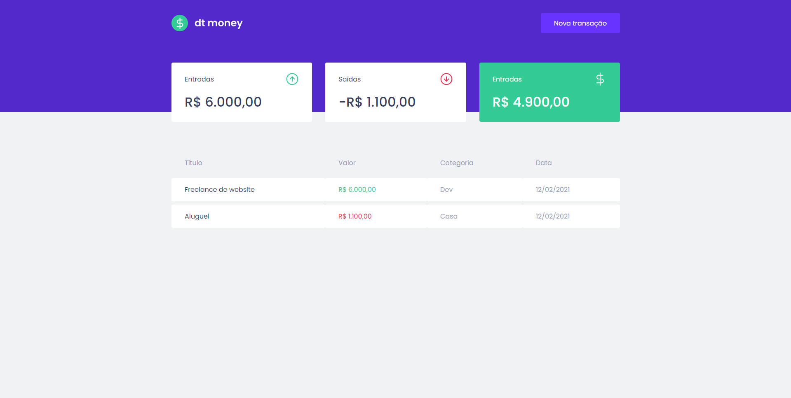
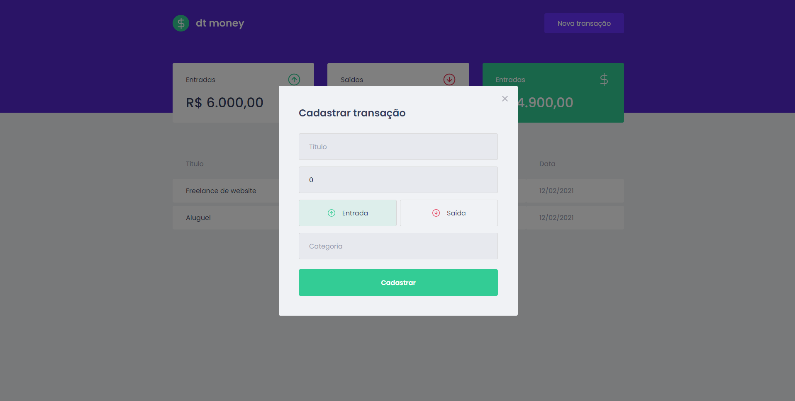

	<a href="#sobre"> Sobre </a>&nbsp;&nbsp;&nbsp;|&nbsp;&nbsp;&nbsp;
  <a href="#techs"> Tecnologias </a>&nbsp;&nbsp;&nbsp;|&nbsp;&nbsp;&nbsp;
  <a href="#run"> Como usar </a>&nbsp;&nbsp;&nbsp;

  
  

  

## Sobre 🚀 <a name="sobre" />

O **dt money** é a aplicação do segundo capítulo do **Ignite** da [Rocketseat](https://rocketseat.com.br/). Nessa aplicações foram aplicados alguns conceitos como o de hooks e contexto.

## Techs ​⚙ ​<a name="techs" />

- React
- Typescript
- Mirage JS
- Context API
- Styled Components
- Polished
- React Toastify
- React Modal

## Instalação e execução ​ℹ️ ​<a name="run" />

1. Faça um clone desse repositório;
2. Entre na pasta rodando `cd ignite-react-capitulo-02`;
3. Rode `yarn` para instalar as dependências;
4. Rode `yarn dev`;
